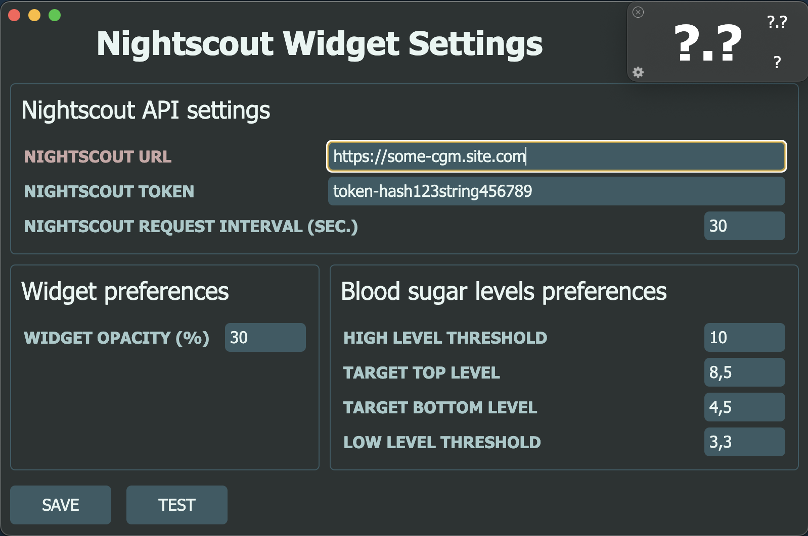

# nightscout-widget-electron

## Project Description

This application, built with Electron, uses the [Nightscout API](https://nightscout.github.io/). The aim is to provide a lightweight interface for your T1D measurement visualization (blood sugar levels).
The widget will stay on top of your screen, so you don't need to keep your Nightscout site in the browser opened to see your/your relative's or kid's measurements in real-time anymore.
I was inspired by the [mlukasek/M5_NightscoutMon](https://github.com/mlukasek/M5_NightscoutMon) solution, built on [M5 Stack's](https://m5stack.com/) hardware platform.


## Content

A current application needs these files:

- `package.json` - Points to the app's main file and lists its details and dependencies.
- `main.js` - Starts the app and creates a widget. This is the app's **main process**.
- `logger.js` - Logger adapter for electron-log library.
- `widget.html` - An HTML file for main window. This is the app's **renderer process** starting point.
- `settings.html` - An HTML file for settings window. This is the app's settings.
- `styles.css` - Styles for the renderer process
- `js/preload.js` - The API interface for IPC messaging between **main process** and **renderer process**.
- `js/backend.js` - The code to obtain data from Nightscout API using AJAX.
- `js/settings.js` - The settings form **renderer process** code.
- `js/util.js` - The code to adapt collected data to a necessary view.
- `js/renderer.js` - The app's core **renderer process** code.
- `js/config.json` - The app's variables.

## To Use

To clone and run this repository you'll need [Git](https://git-scm.com) and [Node.js](https://nodejs.org/en/download/) (which comes with [npm](http://npmjs.com)) installed on your computer. From your command line:

```bash
# Clone this repository
git clone https://github.com/kashamalasha/nightscout-widget-electron
# Go into the repository
cd nightscout-widget-electron
# Install dependencies
npm install
# Run the app
npm start
```

## First start

1. Log in to the admin panel of your Nightscout site (e.g. https://some-cgm.site.com/admin/)
2. Create a new role with the permission to read data using the pattern `*:*:read`
3. Create a new subject for the application with the role created in step 2, or use an existing role with the pattern to read data `*:*:read`
4. Copy the access token for this subject to your clipboard
5. Launch the application.
6. On the first launch, the app will prompt you to enter settings information (see below)
7. Fill in the connection information and your personal preferences for blood sugar levels
8. Press the TEST button to verify the Nightscout site is accessible with the added parameters
9. If all is well, press the SAVE button to save settings and restart the application
10. If you want to fast navigate to the Nightscout site, you can make Shift-Click on the CGV value.

<figure>
  <p>
    
  </p>
  <figcaption>First launch of nightscout-widget-electron</figcaption>
</figure>

## Operating systems

- Compatible with MacOS
- It wasn't tested on Linux or Windows yet, feel free to fork it for testing and using on different OS. I will appreciate any pull request.

## Build Native Applications

You can build a native application for your operating system's preferences from the source code using one of these instruments:

- [electron-forge](https://www.electronforge.io/)
- [electron-builder](https://www.electron.build/)

## Additional Resources

- [electronjs.org/docs](https://electronjs.org/docs) - all of Electron's documentation
- [Nightscout API v3](https://github.com/nightscout/cgm-remote-monitor/blob/master/lib/api3/doc/tutorial.md) - Nightscout API v3 documentation

## License

[GNU GPL v3](LICENSE.md)
