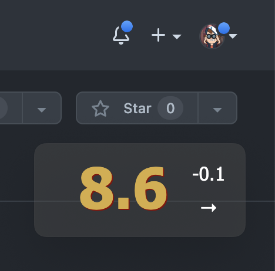

# nightscout-widget-electron

**Description**

This is a minimal Electron application-widget based on the [Nightscout](https://nightscout.github.io/) API. It aims to provide lightweight interface for your T1D measurements visualize. It inspired by [M5Stack's](https://m5stack.com/) similar solutions. It stays always on top of your screen, so you don't need to keep your Nightscout site in browser opened to see your/your relatives or kids measurements in real time anymore.



A current application needs these files:

- `package.json` - Points to the app's main file and lists its details and dependencies.
- `main.js` - Starts the app and creates a widget. This is the app's **main process**.
- `index.html` - An HTML template to render. This is the app's **renderer process** starting point.
- `styles.css` - Styles for the renderer process
- `js/backend.js` - The code to obtain data from Nightscout API using AJAX.
- `js/util.js` - The code to adapt collected data to a necessary view.
- `js/renderer.js` - The app's core **renderer process** code.
- `js/config.json` - The app's variables.

## To Use

To clone and run this repository you'll need [Git](https://git-scm.com) and [Node.js](https://nodejs.org/en/download/) (which comes with [npm](http://npmjs.com)) installed on your computer. From your command line:

```bash
# Clone this repository
git clone https://github.com/kashamalasha/nightscout-widget-electron
# Go into the repository
cd nightscout-widget-electron
# Install dependencies
npm install
# Run the app
npm start
```

## Operating systems

- Compatible with MacOS
- It wasn't tested on Linux or Windows yet, feel free to fork it for testing and using on different OS. I will appreciate any pull request.

## Build Native Applications

You can build a native application for your operating system's preferences from the source code using one of these instruments:

- [electron-forge](https://www.electronforge.io/)
- [electron-builder](https://www.electron.build/)

## Additional Resources

- [electronjs.org/docs](https://electronjs.org/docs) - all of Electron's documentation
- [Nightscout API v3](https://github.com/nightscout/cgm-remote-monitor/blob/master/lib/api3/doc/tutorial.md) - Nightscout API v3 documentation

## License

[GNU GPL v3](LICENSE.md)
