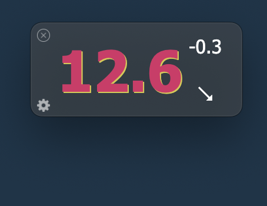
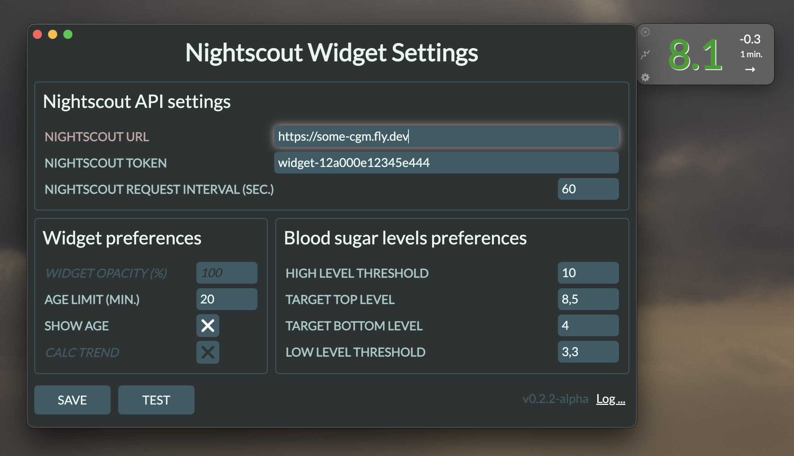
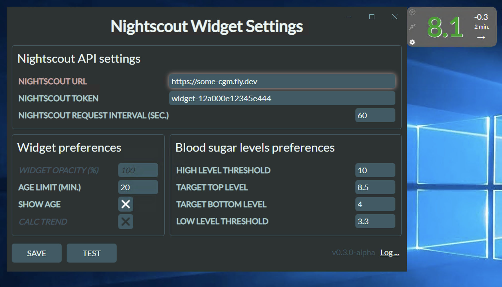
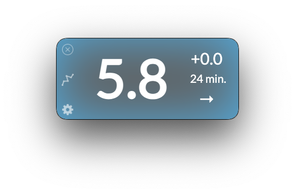
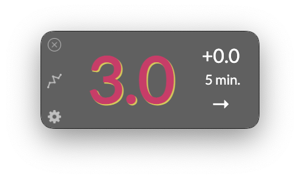
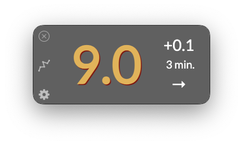

# 🦉 Hello, I am Owlet!

## 👋 Project Description

This is the cross-platform application, built with Electron, uses the [Nightscout API](https://nightscout.github.io/). The aim is to provide a lightweight interface for your T1D measurement visualization (blood sugar levels).
The widget will stay on top of your screen, so you don't need to keep your Nightscout site in the browser opened to see your/your relative's or kid's measurements in real-time anymore.
I was inspired by the [mlukasek/M5_NightscoutMon](https://github.com/mlukasek/M5_NightscoutMon) solution, built on [M5 Stack's](https://m5stack.com/) hardware platform.



### To install (for MacOS and MS Windows)

Download latest release from: https://github.com/kashamalasha/nightscout-widget-electron/releases


## ⚠️ Before start

> ‼️ **THIS IS VERY IMPORTANT**: You have to be sure that all steps are done before the make the first launch!

1. Log in to the admin panel of your Nightscout site (e.g. https://some-cgm.site.com/admin/)
2. Create a new role with the permission to read data using the pattern `*:*:read`
3. Create a new subject for the application with the role created in step 2, or use an existing role with the pattern to read data `*:*:read`
4. Copy the access token for this subject to your clipboard or save it

## 🚀 First start

On the first launch, the app will prompt you to fill the following settings (see below)

<figure>
  <figcaption>First launch of Owlet on MacOS</figcaption>
  <p>
    
  </p>
</figure>

<figure>
  <figcaption>First launch of Owlet on Windows</figcaption>
  <p>
    
  </p>
</figure>

### Nightscout API Settings

- **NIGHTSCOUT URL** - is the address of your nightscout (e.g. https://some-cgm.fly.dev) 
- **NIGHTSCOUT TOKEN** - the access token you've created on the previous steps
- **NIGHTSCOUT REQUEST INTERVAL (SEC.)** - the interval of the getting information from the Nightscout site to display in the widget (60 seconds will be OK)

### Widget preferences
- **AGE LIMIT (MIN.)** - the timeout of data requesting interval, after that interval widget will change their appearance on "frozen" state. Usually it means that reader is offline or detached from the sensor, or the smartphone's battery is drained out


- **SHOW AGE** - that option displays additional information about how old the showing data is


### Blood sugar levels preferences

Set the tracking parameters using following guides:

- Above the **HIGH LEVEL TRESHOLD** and below th **LOW LEVEL THRESHOLD** the last value will be colored in red

- Above the **TARGET TOP LEVEL** and below the **TARGET BOTTOM LEVEL** the last value will be colored in orange

- By default the last value will be colored in green


- You may test the entered connection parameters by clicking the **TEST** button to verify the Nightscout site is accessible and the token is correct

- If everything is ok, press the **SAVE** button to save settings and restart the application

## 🧭 Using the widget

- After restart the widget will always stay on top of the screen until you close it by clicking the top left corner with the X sigh.

- If you need to change the settings you can click by the gear symbol in the bottom left corner.

- If you want to fast navigate to the Nightscout site, you can click by the middle button with the graph symbol.

## 🗜️ Content

A current application includes these files:

- `package.json` - Points to the app's main file and lists its details and dependencies.
- `main.js` - Starts the app and creates a widget. This is the app's **main process**.
- `widget.html` - An HTML file for main window. This is the app's **renderer process** starting point.
- `settings.html` - An HTML file for settings window. This is the app's settings.
- `styles.css` - Styles for the renderer process
- `js/widget.js` - The app's core **renderer process** JS code.
- `js/settings.js` - The settings form **renderer process** JS code.
- `js/logger.js` - Logger adapter for electron-log library.  
- `js/preload.js` - The API interface for IPC messaging between **main process** and **renderer process**.
- `js/backend.js` - The code to obtain data from Nightscout API using AJAX.
- `js/util.js` - The JS code to adapt collected data to a human-readable view.
- `js/auto-update.js` - The app's auto updater JS implementation.
- `js/config-schema.json` - The app's config json schema validation file.
- `js/config-sample.json` - The app's config.json example

## 🛠️ To build it from source code

To clone and run this repository you'll need [Git](https://git-scm.com) and [Node.js](https://nodejs.org/en/download/) (which comes with [npm](http://npmjs.com)) installed on your computer. From your command line do:

```bash
# Clone this repository
git clone https://github.com/kashamalasha/nightscout-widget-electron
# Go into the repository
cd nightscout-widget-electron
# Install dependencies
npm install
# Run the app
npm start
# Or run in developer mode for deeper loggina and debugging
npm run dev
```

### Operating systems

- Compatible with MacOS and MS Windows
- It wasn't tested on Linux yet, feel free to fork it for testing and using on different OS. I will appreciate any pull request.

### Build Native Applications

You can build a native application for your operating system's preferences from the source code using one of these instruments:

- [electron-forge](https://www.electronforge.io/) 
- [electron-builder](https://www.electron.build/) (currently using)

### Additional Resources

- [electronjs.org/docs](https://electronjs.org/docs) - all of Electron's documentation
- [Nightscout API v3](https://github.com/nightscout/cgm-remote-monitor/blob/master/lib/api3/doc/tutorial.md) - Nightscout API v3 documentation

## ⚖️ License

[GNU GPL v3](LICENSE.md)

## ✉️ Contacts
Feel free to contact me any of these ways:
- dmitry.burnyshev@gmail.com
- https://linkedin.com/in/diburn
- https://t.me/diburn

🙏 I'll appreciate any feedback!