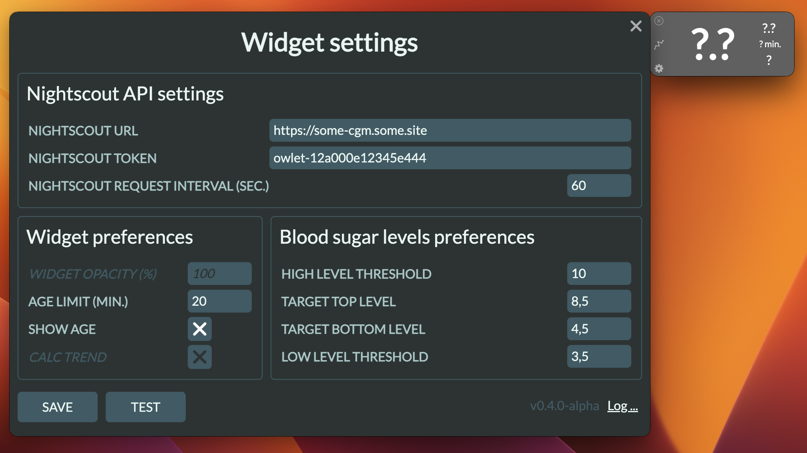

# 🦉 Hello, I am Owlet!

The app's name is "Owlet", which means baby owl and is chosen because of the Nightscout project logo.

## 👋 Project Description

This is the cross-platform application, built with [Electron framework](https://www.electronjs.org/), that uses the [Nightscout API](https://nightscout.github.io/). The aim is to provide a lightweight interface for your `T1D` measurement visualization (blood sugar levels).

The widget will stay on top of your screen, so you don't need to keep your Nightscout site in the browser opened to see your/your relative's or kid's measurements in real-time anymore.

I was inspired by the [mlukasek/M5_NightscoutMon](https://github.com/mlukasek/M5_NightscoutMon) solution, built on [M5 Stack's](https://m5stack.com/) hardware platform.


## 📦 Installation packages

[](https://github.com/kashamalasha/nightscout-widget-electron/releases/download/v0.4.1-beta/Owlet-0.4.1-beta-win.exe)

[](https://github.com/kashamalasha/nightscout-widget-electron/releases/download/v0.4.1-beta/Owlet-0.4.1-beta-mac.dmg)

[](https://github.com/kashamalasha/nightscout-widget-electron/releases/download/v0.4.1-beta/Owlet-0.4.1-beta-linux.AppImage)

[](https://github.com/kashamalasha/nightscout-widget-electron/archive/refs/tags/v0.4.1-beta.tar.gz)

[](https://github.com/kashamalasha/nightscout-widget-electron/releases/latest)

<details>
  <summary><b>LINUX</b> user, expand it and read.. </summary>
  <br>
  The widget is packed in an [AppImage](https://appimage.org/) package due to the following reasons:

  - It runs on all common Linux distributions
  - It supports an auto-update feature (but doesn't support notification about it)
  - AppImage usage simplifies the development process and testing on many different Linux distributions

  I recommend using [AppImageLauncher](https://github.com/TheAssassin/AppImageLauncher) to properly integrate the AppImage into the OS and create all the necessary `.desktop` files to launch it as an installed application. However, this decision is entirely up to you. You can launch the application immediately after downloading from the folder you choose to download and create the `.desktop` file manually.

  Please install the listed dependencies using the OS package manager:

  - wmctrl
  - xdg-utils

  Without these listed dependencies, the widget will still work, but it might be difficult to manage the window states properly (wmctrl is used to hide the app from the application panel and tray) and to open other applications (xdg-open is used to open the browser for redirecting to the Nightscout site and open the file manager to navigate to the logs folder).

  Without these packages, the widget will alert you about the missing dependencies once a day on every launch.

  <b>Auto-update may cause freezing</b>. The application starts checking for updates right after the launch, but only once a day. If it finds a new version in the latest releases, it will begin downloading and replacing the AppImage on your drive, which usually takes about 1-2 minutes. If the application freezes, you need to wait until it awakens, or alternatively, you can kill the process using the `ps` command and restart it.

  Please note that the AppImage doesn't have yet a built-in mechanism to notify about the updates. If you are knowledgeable about how to implement this feature, you are welcome to contribute by submitting a pull request; I would sincerely appreciate it.

</details>

## ⚠️ Before start

> ‼️ **THIS IS VERY IMPORTANT**: You have to be sure that all steps are done before you make the first launch!

1. Log in to the admin panel of your Nightscout site (e.g. https://some-cgm.site.com/admin/)
2. Create a new role with permission to read data using the pattern `*:*:read`
3. Create a new subject for the application with the role created in step 2, or use an existing role with the pattern to read data `*:*:read`
4. Copy the access token for this subject to your clipboard or save it

## 🚀 First start

On the first launch, the app will prompt you to fill in the following settings

<figure>
  <p>
    
  </p>
</figure>

### 1. Nightscout API Settings

- **NIGHTSCOUT URL** - is the address of your nightscout (e.g. https://some-cgm.fly.dev) 
- **NIGHTSCOUT TOKEN** - the access token you've created on the previous steps
- **NIGHTSCOUT REQUEST INTERVAL (SEC.)** - (*default: 60*) the interval of the getting information from the Nightscout site to display in the widget

### 2. Widget preferences
- **AGE LIMIT (MIN.)** - (*default: 20*) the timeout of data requesting interval, after that interval widget will change its appearance to "frozen" state. Usually, it means that the reader is offline or detached from the sensor, or the smartphone's battery is drained out


- **SHOW AGE** - (*default: enabled*) that option displays additional information about how old the shown data is


### 3. Blood sugar levels preferences


Set the blood sugar tracking parameters using the following guides:

- Above the **HIGH LEVEL TRESHOLD** (*default: 10*) and below th **LOW LEVEL THRESHOLD** (*default: 3.5*) the last value will be colored in red


- Above the **TARGET TOP LEVEL** (*default: 8.5*) and below the **TARGET BOTTOM LEVEL** (*default: 4*) the last value will be colored in orange


- By default, the last value will be colored in green


- You may test the entered connection parameters by clicking the **TEST** button to verify the Nightscout site is accessible and the token is correct
- If everything is ok, press the **SAVE** button to save settings and restart the application

## 🧭 Using the widget

- After restarting, the widget will always stay on top of the screen until you close it by clicking the top left corner with the X sign.
- If you need to change the settings you can click by the gear symbol in the bottom left corner.
- If you want to fast navigate to the Nightscout site, you can click the middle button with the graph symbol.

## ⬇️ Auto updates

- The widget has a built-in implementation of the update system.
- The widget will check for the latest release availability every time it starts, but only once a day.
- If the latest release is available, the widget will automatically download and install it right after exiting.
- On **Mac** and **Windows** operating systems, users will receive a notification about the newly downloaded version.
- On **Linux**, the notification doesn't work properly yet.

## 🚧 In Progress 

- Feature of selecting mmol/l <-> mg/dl measurement units
- Feature of calculating trend indicator when this data is absent on Nightscout
- Localization
- Github-page landing using Jakil

If you feel desire to improve it or help. You can suggest any ideas or detected bugs to the project board:
https://github.com/users/kashamalasha/projects/2/views/1 

## 🗜️ Content

The current application includes these files:

- `package.json` - Points to the app's main file and lists its details and dependencies.
- `main.js` - Starts the app and creates a widget. This is the app's **main process**.
- `widget.html` - An HTML file for the main window. This is the app's **renderer process** starting point.
- `settings.html` - An HTML file for the settings window. This is the app's settings.
- `styles.css` - Styles for the renderer process
- `js/widget.js` - The app's core **renderer process** JS code.
- `js/settings.js` - The settings form **renderer process** JS code.
- `js/logger.js` - Logger adapter for electron-log library.  
- `js/preload.js` - The API interface for IPC messaging between **main process** and **renderer process**.
- `js/backend.js` - The code to obtain data from Nightscout API using AJAX.
- `js/util.js` - The JS code to adapt collected data to a human-readable view.
- `js/auto-update.js` - The app's auto-updater JS implementation.
- `js/config-schema.json` - The app's config json schema validation file.
- `js/config-sample.json` - The app's config.json example
- `js/config-default.json` - The default values for the config.json

## 🛠️ To build it from source code

To clone and run this repository, you'll need [Git](https://git-scm.com) and [Node.js](https://nodejs.org/en/download/) (which comes with [npm](http://npmjs.com)) installed on your computer. From your command line do:

```bash
# Clone this repository
git clone https://github.com/kashamalasha/nightscout-widget-electron
# Go into the repository
cd nightscout-widget-electron
# Install dependencies
npm install
# Run the app
npm start
# Or run in developer mode for deeper logging and debugging
npm run dev
```

### Operating systems

Compatible with:
* MacOS, 
* MS Windows, 
* Linux (tested on Ubuntu, Fedora, CentOS, Alma on GNOME Desktop and XFCE)

### Build Native Applications

You can build a native application for your operating system's preferences from the source code using one of these tools:

- [electron-forge](https://www.electronforge.io/) 
- [electron-builder](https://www.electron.build/) (currently using)

### Additional Resources

- [electronjs.org/docs](https://electronjs.org/docs) - all of Electron's documentation
- [electron.build](https://electron.build) - electron-builder documentationn
- [Nightscout API v3](https://github.com/nightscout/cgm-remote-monitor/blob/master/lib/api3/doc/tutorial.md) - Nightscout API v3 documentation
- [Icons8.com](https://icons8.com/) - Great icons and assets collection that I used in this project

## ⚖️ License

[GNU GPL v3](LICENSE.md)

## ✉️ Contacts
Feel free to contact me any of these ways:
- dmitry.burnyshev@gmail.com
- https://linkedin.com/in/diburn
- https://t.me/diburn

🙏 I'll appreciate any feedback!
