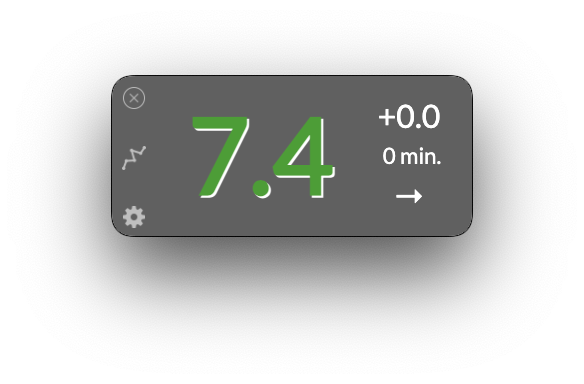
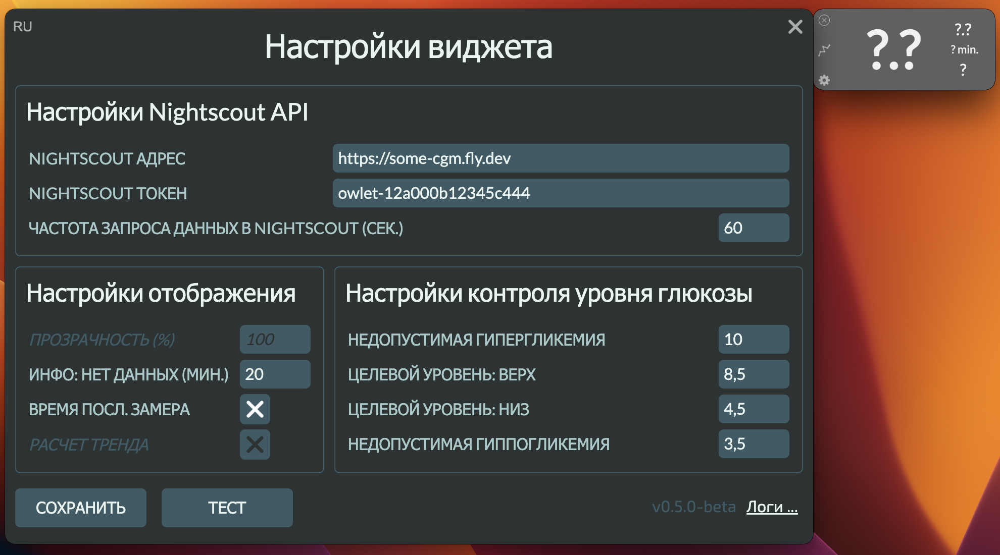
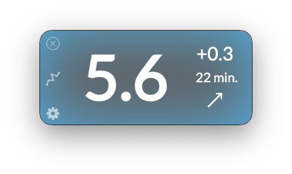
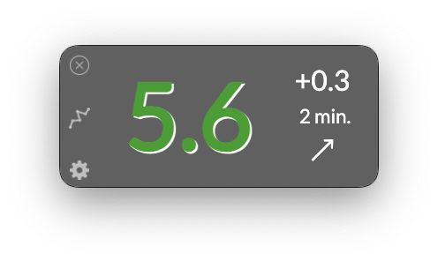
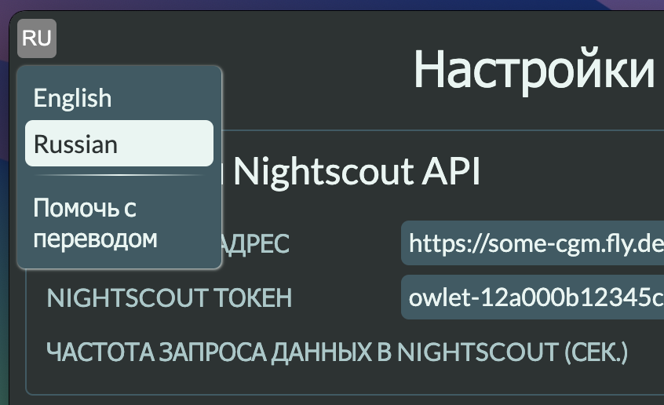

# 🦉 Привет, я Owlet (Алет)!

[](https://github.com/kashamalasha/nightscout-widget-electron/blob/main/README.md)

Название приложения - "Owlet", переводится как совёнок, оно было выбрано мной по схожести логотипа Nightscout со взрослой совой.

## 👋 Описание проекта

Owlet - это кросс-платформенное приложение, разработанное на движке [Electron framework](https://www.electronjs.org/), использующее инструменты [Nightscout API](https://nightscout.github.io/) с целью разработать лаконичный интерфейс для наблюдения за показателями уровня сахара в крови людей с сахарным диабетом (T1D) в режиме реального времени.

Приложение представляет собой виджет, который располагается поверх всех окон на рабочем столе вашего компьютера. Таким образом, вам не требуется постоянно держать открытой вкладку браузера со страницей Nightscout, чтобы быть в курсе состояния вашего ребенка или родственника.

Я вдохновлялся решением [mlukasek/M5_NightscoutMon](https://github.com/mlukasek/M5_NightscoutMon), собранным на аппаратном стэке [M5 Stack's](https://m5stack.com/).



## 📦 Установка приложения

[](https://github.com/kashamalasha/nightscout-widget-electron/releases/download/v0.5.0-beta/Owlet-0.5.0-beta-win-x64.exe)

[%20.dmg-blue?style=for-the-badge&logo=apple)](https://github.com/kashamalasha/nightscout-widget-electron/releases/download/v0.5.0-beta/Owlet-0.5.0-beta-mac-arm64.dmg)

[%20.dmg-blue?style=for-the-badge&logo=apple)](https://github.com/kashamalasha/nightscout-widget-electron/releases/download/v0.5.0-beta/Owlet-0.5.0-beta-mac-x64.dmg)

[](https://github.com/kashamalasha/nightscout-widget-electron/releases/download/v0.5.0-beta/Owlet-0.5.0-beta-linux-x86_64.AppImage)

[](https://github.com/kashamalasha/nightscout-widget-electron/archive/refs/tags/v0.5.0-beta.tar.gz)

[](https://github.com/kashamalasha/nightscout-widget-electron/releases/latest)

<details>
  <summary>Информация для <b>LINUX</b> пользователей, откройте и прочтите.. </summary>
  <br>
  Виджет упакован в [AppImage](https://appimage.org/) пакет потому что:

  - Он запускается на любом известном Linux дистрибутиве
  - Он поддерживает функцию авто-обновления (с особенностями работы с уведомлениями)
  - AppImage упрощает процесс разработки и тестирования под Linux 

  Я рекомендую использовать [AppImageLauncher](https://github.com/TheAssassin/AppImageLauncher) для полноценной установки AppImage на ваш дистрибутив. Это позволяет автоматически создать `.desktop` файл для запуска с GUI. Однако, вы можете самостоятельно настроить окружение для работы с приложением. Можно запустить приложение сразу же после загрузки, самостоятельно выбрать расположение для файла и вручную создать `.desktop` файл.

  Пожалуйста установите перечисленные зависимости, используя системный менеджер пакетов:

  - wmctrl
  - xdg-utils

  Без этих зависимостей виджет будет работать, но может быть затруднена работа с некоторыми функциями приложения. **wmctrl** используется для сокрытия приложения на панели приложений и в системном лотке (трее). **xdg-open** используется для вызова браузера при переходе на сайт Nightscout и для открытия файлового менеджера при переходе к просмотру логов.

  Без этих пакетов, приложение будет напоминать о необходимости их установки при каждом запуске один раз в день.

  <b>Функция автоматического обновления может периодически "подвешивать" приложение</b>. При запуске приложение выполняет автоматическую провеку на наличие доступных обновлений. Если новая версия приложения опубликована, она будет загружена, и AppImage на вашем диске будет заменен ею. Обычно это занимает 1-2 минуты. Если приложение при запуске подвисло и не реагирует на действия пользователя, вам нужно подождать какое-то время, пока оно не отвиснет. Вы также можете убить процесс через `ps` команду в консоли и перезапустить приложение вручную.

  AppImage использует встроенный в ваш дистрибутив механизм уведомления пользователя об обновлениях. Если notification-daemon не прописан должным образом в dbus сервисах, обновление AppImage вызывает подвисания. Если notification daemon настроен должным образом (выполнение команды `notify-send "Hello world"` в консоли вернет уведомление на рабочий стол), проблем быть не должно и вы увидите уведомление об обновлении точно так же, как его видят пользователи Windows и MacOS. Если у вас есть понимание того, как можно выполнять проверку на корректность настройки notification-daemon и получать понятно интерпретируемый output (`notify-send "You shouldn't see me" && echo $?`) без вывода уведомления на экран, я буду рад обратной связи в любом виде. Будь то pull request с готовым решением, или просто совет через личные сообщения.

</details>

## ⚠️ Прежде чем начать

> ‼️ **ЭТО ОЧЕНЬ ВАЖНО**: Вы должны убедиться, что все шаги пройдены, прежде чем выполнять первый запуск приложения!

1. Залогиньтесь в панель администратора на вашем сайте Nightscout (например https://some-cgm.site.com/admin/)
2. Создайте новую роль с правами доступа на чтение данных используя правило `*:*:read`
3. Создайте новый субъект для приложения с ранее созданной ролью на шаге 2, или используйте существующую роль с правилом на чтение данных `*:*:read`
4. Скопируйте созданный для нового субъекта токен в буфер обмена или сохрание его

## 🚀 Первый запуск

При первом запуске приложение попросит вас заполнить следующие настройки

<figure>
  <p>
    
  </p>
</figure>

### 1. Настройки Nightscout API

- **NIGHTSCOUT АДРЕС** - адрес вашего Nightscout сайта (напр. https://some-cgm.fly.dev) 
- **NIGHTSCOUT ТОКЕН** - токен доступа, который вы создали ранее (напр. owlet-12a000b12345c444)
- **ЧАСТОТА ЗАПРОСА ДАННЫХ В NIGHTSCOUT (CЕК.)** - (*по-умолчанию: 60*) интервал запроса данных от Nightscout сайта для отображения измерений в виджете

### 2. Настройки отображения
- **ИНФО: НЕТ ДАННЫХ (МИН.)** - (*по-умолчанию: 20*) интервал просрока запроса данных, после которого виджет сменит внешний вид на "замерзшее" состояние. Обычно это означает, что считыватель или передатчик находятся в состоянии offline (села батарея телефона или считывателя) или сенсор вышел из строя и престал отдавать результаты измерений.



- **ВРЕМЯ ПОСЛ. ЗАМЕРА** - (*по-умолчанию: включено*) эта опция позволяет отображать информацию о том, как давно было получено последнее измерение


### 3. Настройки контроля уровня глюкозы


Настройка параметров отображения уровней контроля сахара в крови. Задайте параметры отображения, используя следующие правила:

- Значения выше уровня **НЕДОПУСТИМАЯ ГИПЕРГЛИКЕМИЯ** (*по-умолчанию: 10*) и ниже уровня **НЕДОПУСТИМАЯ ГИППОГЛИКЕМИЯ** (*по-умолчанию: 3.5*) будут окрашены в красный цвет


- Значения выше уровня **ЦЕЛЕВОЙ УРОВЕНЬ: ВЕРХ** (*по-умолчанию: 8.5*) и ниже уровня **ЦЕЛЕВОЙ УРОВЕНЬ: НИЗ** (*по-умолчанию: 4*) будут окрашены в желтый цвет


- По-умолчанию, последнее полученное значение (в пределах целевого уровня) окрашивается в зеленый



- Вы можете проверить корректность настроек подключения к сайту Nightscout, нажав кнопку **ТЕСТ**, чтобы убедиться в работоспособности токена и доступности Nightscout.
- Если все настройки заданы и проверены, нажмите кнопку **CОХРАНИТЬ**, чтобы сохранить настройки и перезапустить приложение


### 4. Язык настроек и локализация приложения


- Вы можете изменить язык настроек, кликнув в левый верхний угол приложения, и выбрав предпочтительный для отображения язык из меню.

<figure>
  <p>
    
  </p>
</figure>

- В настоящий момент поддерживаются 2 языка: 
**Анлийский** и **Русский**.

- Если вы хорошо владеете другим языком, то можете поучаствовать в переводе приложения, подключившись к проекту локализации на [POEditor](https://poeditor.com/projects/view?id=640131) в качестве контрибутора

## 🧭 Использование виджета

- После перезапуска виджет отобразит полученное значение и останется поверх всех окон до тех пор, пока вы не решите **закрыть** его, кликнув в левый верхний угол на символ Х
- Если вы хотите **изменить настройки**, вы в любой момент можете это сделать, кликнув на значок шестерни в левом нижнем углу виджета
- Если вы захотите **быстро перейти на сайт Nightscout**, вы можете кликнуть в среднюю кнопку левого края виджета со значком графика

## ⬇️ Авто обновления

- Приложение имеет встроенный механизм автоматической проверки обновлений
- Приложение будет проверять наличие обновлений при запуске, но не чаще, чем раз в сутки
- Если обновление доступно, приложение автоматически его загрузит и установит сразу после закрытия виджета.
- На операционных системах **MacOS** и **Windows**, пользователь получит уведомление о том, что была загружена новая версия приложения
- На операционной системе **Linux**, уведомления об обновлении не всегда могут работать корректно (см. выше)

## 🚧 В работе

- Функция выбора единиц отображения измерений: mmol/l <-> mg/dl 
- Функция определения направления тренда для тех сенсоров, что не имеют встроенного определителя тренда
- Перевод приложения
- Github лэндинг страница (с использованием движка Jakil)

Если вы чувствуете в себе силы что-то улучить или помочь, я буду рад. Вы можете предложить идею или сообщить об ошибке, создав заявку на [доске](https://github.com/users/kashamalasha/projects/2/views/1).

## 🗜️ Содержимое

Текущая сборка приложения включает в себя следующие файлы:

- `package.json` - NodeJS файл настроек приложения, список зависимостей и конфигурации сборки.
- `main.js` - Основной файл приложения. Это входная точка в Electron **main process**.
- `widget.html` - HTML файл с версткой основного окна виджета. Это входная точка в Electron **renderer process**.
- `settings.html` - HTML файл с версткой окна настроек приложения.
- `styles.css` - Стили для renderer процесса.
- `js/widget.js` - Файл с логикой для **renderer process** окна виджета.
- `js/settings.js` - Файл с логикой для **renderer process** окна настроек.
- `js/logger.js` - Адаптер логгера для библиотеки electron-log.  
- `js/preload.js` - API интерфейс для организации IPC обмена между **main process** и **renderer process** в Electron.
- `js/backend.js` - Файл с логикой получения данных по измерениям через Nightscout API используя AJAX.
- `js/util.js` - Утилиты для преобразования полученных данных в удобо читаемый вид.
- `js/auto-update.js` - Файл с логикой авто-обновления приложения.
- `js/translator.js` - Файл с логикой локализации приложения.
- `js/localization/{lang}.json` - Набор ключей для локализации приложения.
- `js/config-schema.json` - Json schema конфигурации настроек.
- `js/config-sample.json` - Пример файла с настройками приложения.
- `js/config-default.json` - Файл с настройками по-умолчанию для генерации config.json при первом запуске приложения.
- `build/` - Каталог файлов, для поддержки локальной сборки приложения
- `docs/` - Скриншоты для этого README.

## 🛠️ Сборка из исходников

Для клонирования и запуска приложения из репозитория вам потребуются [Git](https://git-scm.com) и [Node.js](https://nodejs.org/en/download/) (который поставляется с [npm](http://npmjs.com)) установленные на вашем ПК. Для сборки из исходного кода в командной строке выполните:

```bash
# Клонирует master ветку репозитория
git clone https://github.com/kashamalasha/nightscout-widget-electron
# Переходит в папку с клоном репозитория
cd nightscout-widget-electron
# Устанавливает недостающие зависимости
npm install
# Запускает приложение
npm start
# Или запускает приложение в developer mode для более детального логирования и отладки
npm run dev
```

### Поддерживаемые операционные системы

Приложение совместимо и протестировано на:
* MacOS, 
* MS Windows, 
* Linux (протестировано на: Ubuntu, Fedora, CentOS, Alma на GNOME Desktop и XFCE)

### Сборка нативного приложения

Вы можете собрать нативное приложение под свою операционную систему из исходников используя один из следующих инструментов сборки:

- [electron-forge](https://www.electronforge.io/) 
- [electron-builder](https://www.electron.build/) (используется для сборки текущего проекта)

### Дополнительные ресурсы

- [electronjs.org/docs](https://electronjs.org/docs) - вся документация на Electron
- [electron.build](https://electron.build) - документация electron-builder
- [Nightscout API v3](https://github.com/nightscout/cgm-remote-monitor/blob/master/lib/api3/doc/tutorial.md) - документация для Nightscout API v3
- [Icons8.com](https://icons8.com/) - отличные иконки и картинки, которые используются в этом проекте
- [POEditor](https://poeditor.com/projects/view?id=640131) - проект локализации приложения

## ⚖️ Лицензия

[GNU GPL v3](LICENSE.md)

## ✉️ Обратная связь
Обратную связь вы можете оставить следующим путем:
- dmitry.burnyshev@gmail.com
- https://linkedin.com/in/diburn
- https://t.me/diburn

🙏 Я заранее признателен любой обратной связи.
