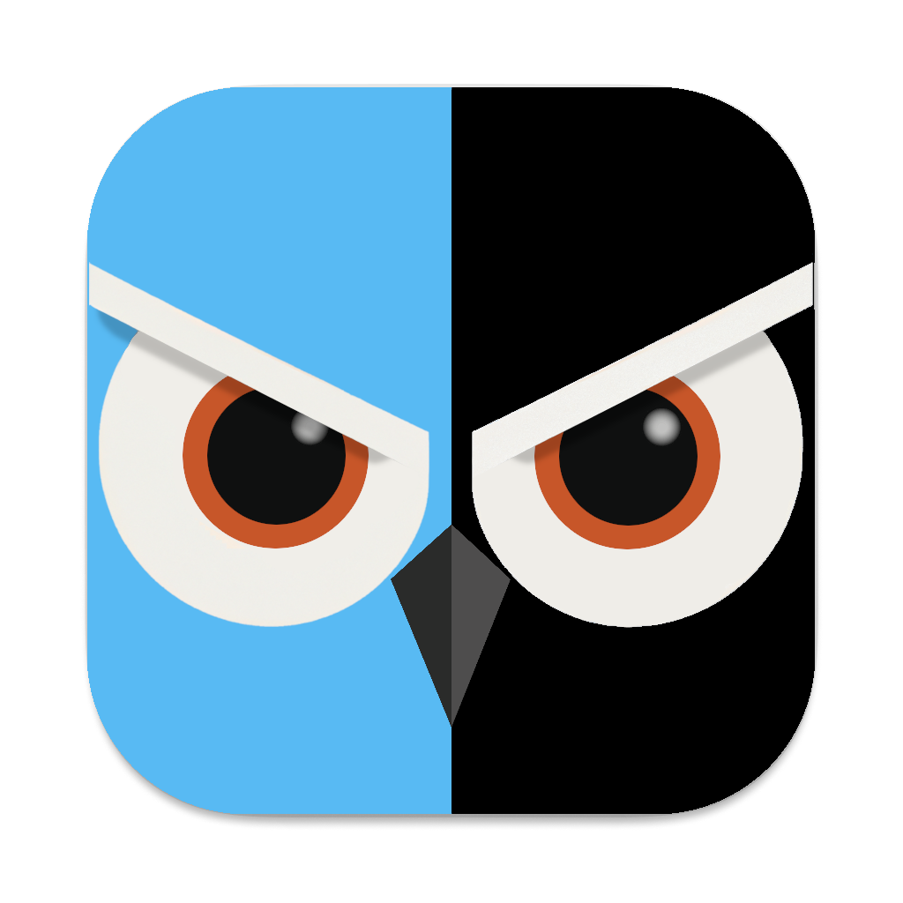
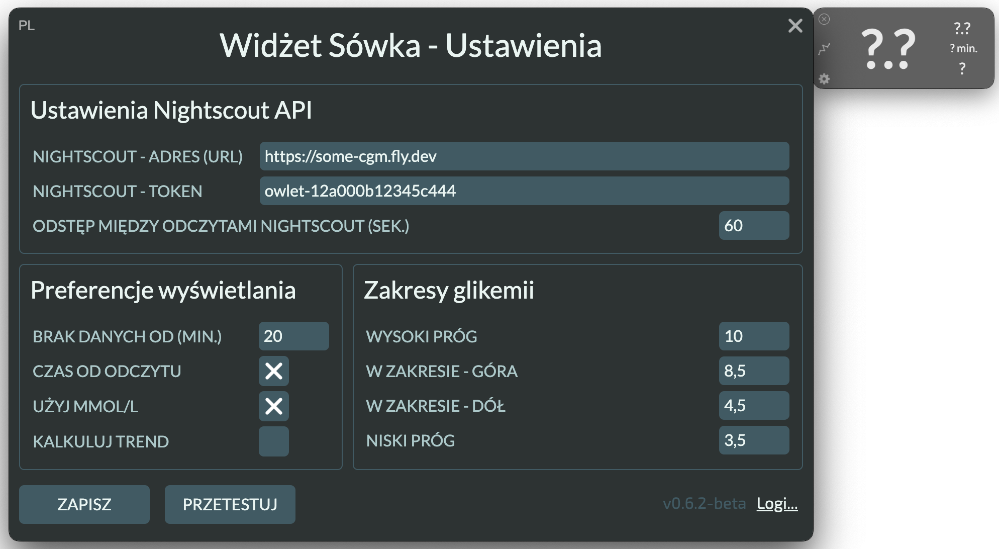
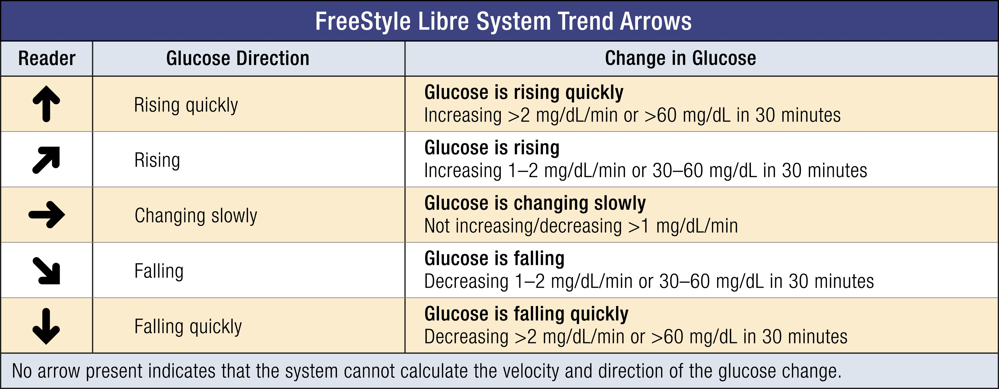
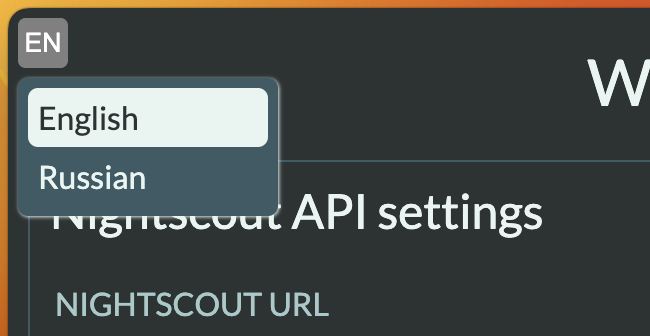

<a href="#"></a>


# Owlet

Owlet jest projektem międzyplatformowym zbudowanym przy wykorzystującego [API Nightscout](https://nightscout.github.io/). Celem było przygotowanie ultralekkiego interfejsu dla dyskretnej i ciągłej obserwacji odczytów glikemii z twojego systemu CGM.

Aplikacja nosi nazwę „Owlet”, co oznacza małą sowę i została wybrana ze względu na logo projektu Nightscout.

<div>
  <a href="https://github.com/kashamalasha/nightscout-widget-electron/releases"></a>
  <a href="https://github.com/kashamalasha/nightscout-widget-electron/releases/latest"></a>
  <a href="https://github.com/kashamalasha/nightscout-widget-electron/releases/latest"></a>
</div>
<div style="margin-top: 5px">
  <a style="margin: 5px;" href="https://boosty.to/owlet/donate"></a>
  <a style="margin: 5px;" href="https://www.paypal.com/donate/?business=46K7J6S3UB3CS&no_recurring=0&item_name=Support+Owlet%3A+Improve+T1D+care+with+a+donation%21+Your+contribution+empowers+health+monitoring.+Join+me+in+making+a+difference%21&currency_code=USD"></a>
</div>

## Tłumaczenie README

[](https://github.com/kashamalasha/nightscout-widget-electron/blob/main/README.md)
[](https://github.com/kashamalasha/nightscout-widget-electron/blob/main/docs/README.it.md)
[](https://github.com/kashamalasha/nightscout-widget-electron/blob/main/docs/README.ru.md)


## Opis Projektu

Widżet pozostaje ponad wszystkimi oknami, nie musisz już utrzymywać otwartej zakładki Nightscout w przeglądarce, aby na bieżąco śledzić zmiany poziomu glukozy u siebie lub swojego dziecka/podopieczniego.

Zainspirowałem się rozwiązaniem [mlukasek/M5_NightscoutMon](https://github.com/mlukasek/M5_NightscoutMon), zbudowanym na platformie sprzętowej [M5 Stack's](https://m5stack.com/).


## Gotowe pakiety instalacyjne

[](https://github.com/kashamalasha/nightscout-widget-electron/releases/download/v0.8.1-beta/Owlet-0.8.1-beta-win-x64.exe)

[%20.dmg-blue?style=for-the-badge&logo=apple)](https://github.com/kashamalasha/nightscout-widget-electron/releases/download/v0.8.1-beta/Owlet-0.8.1-beta-mac-arm64.dmg)

[%20.dmg-blue?style=for-the-badge&logo=apple)](https://github.com/kashamalasha/nightscout-widget-electron/releases/download/v0.8.1-beta/Owlet-0.8.1-beta-mac-x64.dmg)

[](https://github.com/kashamalasha/nightscout-widget-electron/releases/download/v0.8.1-beta/Owlet-0.8.1-beta-linux-x86_64.AppImage)

[](https://github.com/kashamalasha/nightscout-widget-electron/archive/refs/tags/v0.8.1-beta.tar.gz)

[](https://github.com/kashamalasha/nightscout-widget-electron/releases/latest)

<details>
  <summary><b>LINUX</b> user, expand it and read.. (English)</summary>
  <br>
  The widget is packed in an [AppImage](https://appimage.org/) package due to the following reasons:

  - It runs on all common Linux distributions
  - It supports an auto-update feature (but doesn't support notification about it)
  - AppImage usage simplifies the development process and testing on many different Linux distributions

  I recommend using [AppImageLauncher](https://github.com/TheAssassin/AppImageLauncher) to properly integrate the AppImage into the OS and create all the necessary `.desktop` files to launch it as an installed application. However, this decision is entirely up to you. You can launch the application immediately after downloading from the folder you choose to download and create the `.desktop` file manually.

  Please install the listed dependencies using the OS package manager:

  - wmctrl
  - xdg-utils

  Without these listed dependencies, the widget will still work, but it might be difficult to manage the window states properly (`wmctrl` is used to hide the app from the application panel and tray) and to open other applications (`xdg-open` is used to open the browser for redirecting to the Nightscout site and open the file manager to navigate to the logs folder).

  Without these packages, the widget will alert you about the missing dependencies once a day on every launch.

  <b>Auto-update may cause freezing</b>. The application starts checking for updates right after the launch, but only once a day. If it finds a new version in the latest releases, it will begin downloading and replacing the AppImage on your drive, which usually takes about 1-2 minutes. If the application freezes, you need to wait until it awakens, or alternatively, you can kill the process using the `ps` command and restart it.

  The issue is related to the lack of usability of the `notification-daemon`. Sometimes, the D-Bus service doesn't configure properly, and as a result, the `notify-send` command cannot be executed. If the `notify-send` command works fine on your distribution, then it is not your issue, and everything should function properly.

  Please note that the AppImage doesn't have yet a built-in mechanism to notify about the updates. If you are knowledgeable about how to implement this feature, you are welcome to contribute by submitting a pull request; I would sincerely appreciate it.

</details>


## ⚠️ Zanim zaczniesz

> ‼️ **TO JEST BARDZO WAŻNE**: Musisz się upewnić, że wykonałeś/aś wszystkie poniższe kroki jeszcze przed pierwszym uruchomieniem aplikacji!

1. Wejdź na swoją stronę Nightscout, zaloguj się swoim API Secret i z menu hamburger wybierz Narzędzia administratora (np. https://some-cgm.site.com/admin/)
2. Utwórz nowy obiekt o nazwie owlet i uprawnieniach readable `*:*:read`
3. Po dodaniu obiektu kliknij niebieski link, strona otworzy się w nowej zakładce
4. Wykopiuj pełny adres strony, razem z zawartym w nim tokenem - wystarczy skopiować do schowka, ale możesz także zapisać w pliku


## Pierwsze uruchomienie

Przy pierwszym uruchomieniu aplikacja poprosi o uzupełnienie danych i wybór odpowiednich ustawień. Zanim przejdziesz dalej, zerknij na lewy górny róg okna ustawień - znajduje się w nim przełącznik języka. Wybierz Polish.

<figure>
  <p>
    
  </p>
</figure>


### 1. Ustawienia Nightscout API

- **NIGHTSCOUT - ADRES (URL)** - to jest twój adres Nightscout (np. https://some-cgm.fly.dev) - wklej tu zawartość schowka, skasuj znaki /? jeśli zostały na końcu po przeniesieniu tokena do pola niżej
- **NIGHTSCOUT - TOKEN** - token wykopiowany z pola powyżej, jeśli robiłeś/aś wszystko zgodnie z instrukcję, będzie się zaczynał od owlet-
- **CZAS MIĘDZY ODCZYTAMI NIGHTSCOUT (SEK.)** - (*domyślnie: 60*) czas pomiędzy kolejnymi zapytaniami do strony Nightscout. Dla FreeStyle Libre z odczytami co minutę wybierz 60, dla pozostałych systemów CGM możesz wydłużyć czas do 300. Jeśli odczyty będą opóźnione, zmniejszaj ten parametr.


### 2. Preferencje wyświetlania

- **BRAK DANYH OD (MIN.)** - (*domyślnie: 20*) parametr wskazuje czas w minutach, po którym aplikacja uzna połączenie z sensorem CGM za "zamrożone". Zwykle oznacza to brak połączenia z internetem aplikacji CGM, błąd/awarię/utratę sensora lub transmitera, albo po prostu wyczerpanie baterii smartfona obsługującego system CGM. Jeśli wolisz, by widżet nie oznaczał takiego stanu, po prostu wpisz tu 0. Maksymalna doswolona wartość to 999, co oznacza 999 minut przed oznaczeniem sensora jako offline/zamrożony.


- **CZAS OD ODCZYTU** - (*domyślnie: włączony*) pokazuje czas w minutach, jaki upłynął od odtatniego odczytu CGM

- **UŻYJ MMOL/L** - (*domyślnie: włączony*) właczenie tej opcji oznacza obsługę w mmol/L zamiast mg/dL. Pamiętaj, że musisz także zweryfikować zakresy poziomu glukozy we krwi w prawym panelu, i o zapisaniu ustawień po dostosowaniu systemu jednostek miary.
  
- **KALKULUJ TREND** - (*domyślnie: wyłączony*) włączenie tej opcji spowoduje wewnętrzne wyliczanie strzałki trendu na podstawie ostatnich sześciu odczytów (czyli z ostatnich 30 minut). Włącz jeśli zamiast strzałki trendu zobaczysz na widźecie, w prawym dolnym rogu, znak "-" (minus). W standardowych warunkach opcja ta nie wymaga włączenia - dane o trendzie będą przekazywane przez Nightscout.

Aplikacja używa metody wyliczania trendu znanego z systemu FreeStyle Libre™ produkowanych przez Abbot™.

<figure>
  <p>
    
  </p>
</figure>

Więcej informacji o strzałkach trendu, ich interpretacji oraz zasadach dostosowania dawek insuliny znajdziesz w artykule **Journal of the Endocrine Society**: [Approach to Using Trend Arrows in the FreeStyle Libre Flash Glucose Monitoring Systems in Adults](https://academic.oup.com/jes/article/2/12/1320/5181247). 

[Wersja PDF](docs/js.2018-00294.pdf) w/w artykułu do ściągnięcia.


### 3. Zakresy wyświetlania glikemii

Ustaw zakresy wyświetlania glikemii zgodnie z poniższymi wytycznymi, zgodnymi z consensusem ATTD 2019. Domyślne wartości w polach są wyrażone w mmol/L i dla polskich użytkowniów powinny być zmienione na wartości w mg/dL. Polskie tłumaczenie zawiera w nawiasach podpowiedź co do standardowych wartości wyświetlania. Znajdą one zastosowanie w większości przypadków, użyj innych jeśli jesteś kobietą w ciąży lub i/lub masz inne wytyczne od swojego diabetologa.

- Powyżej znacznika **WYSOKI (250)** (*domyślnie: 10*) i poniżej znacznika **NISKI (55)** (*domyślnie: 3.5*) ostatni odczyt na widźecie będzie w kolorze czerwonym


- Powyżej **W ZAKRESIE - GÓRA (180)** (*domyślnie: 8.5*) i poniżej **W ZAKRESIE - DÓŁ (70)** (*domyślnie: 4*) ostatni odczyt na widźecie będzie w kolorze pomarańczowym


- Pomiędzy znacznikami **W ZAKRESIE - DÓŁ (70)** i **W ZAKRESIE - GÓRA (180)** ostatni odczyt na widźecie będzie w kolorze zielonym - i tego widoku wam życzymy jak najczęściej :)


- Możesz przetestować wpisane parametry połączenia z Nightscout klikając przycisk **PRZETESTUJ** aby upewnić się, czy wprowadzony URL i token są poprawne
- 
- Jeśli wszystko jest w porządku, kliknij przycisk **ZAPISZ** aby trwale zapisać ustawienia widżetu i go zrestartować


### 4. Zmiana języka i lokalizacji

- Możesz zmienić wersję językową klikając znacznik **EN** w prawym górnym roku okna ustawień i wybierając preferowany język. Znacznik zmieni się na **PL** w przypadku języka polskiego.

<figure>
  <p>
    
  </p>
</figure>

- Aktualnie aplikacja oferuje języki: 
  - English
  - Hebrew
  - Italian
  - Polish
  - Russian
  - Slovak
  - Spanish

- Jeśli czujesz się na siłach, chcesz pomóc w rozwoju aplikacji, to zapraszamy do zespołu w roli tłumacza. Wystarczy założyć konto w [POEditor](https://poeditor.com/join/project/PzcEMSOFc7) i zgłosić się do mnie (metody kontaktu na dole tego pliku).


## Użytkowanie widżetu

- Po każdorazowym restarcie komputera widżet zostanie automatycznie uruchomiony i pozostanie na ekranie ponad wszelkimi widocznymi oknami innych aplikacji. Tak będzie do momentu wyłączenia aplikacji poprzez kliknięcie znaku X w lewym górnym rogu widżetu. 
- Jeśli chcesz dokonać zmian w ustawieniach, kliknij ikonkę zębatki w dolnym lewym rogu widżetu.
- Jeśli chcesz szybko otworzyć stronę Nightscout, kliknij środkową ikonkę (wykres) po lewej stronie widżetu. Twoja strona Nightscout otworzy się w domyślnej przeglądarce.


## Automatyczne aktualizacje

- Aplikacja posiada wbudowany mechanizm automatycznych aktualizacji.
- Aplikacja sprawdzi, czy pojawiła się nowsza wersja przy każdym starcie widżetu, jednakże nie częściej niż raz dziennie.
- Jeśli na serwerze developera dostępna jest nowsza wersja, aplikacja ściągnie i zainstaluje ją przy kolejnym zamknięciu widżetu (ręcznym lub podczas zamykania systemu).
- Na platformach **macOS** i **Windows** użytkownik otrzyma stosowną informację o pobraniu nowszej wersji. 
- Na komputerach z systemem **Linux**, takie powiadomienie nie działa jeszcze poprawnie.


## Aktualnie w przygotowaniu

- Unit tests coverage using [Jest](https://jestjs.io/)
- Strona internetowa projektu bazująca na [Jekyll](https://jekyllrb.com/)
- Wymiana silnika aplikacji Electron na [Tauri app](https://beta.tauri.app/)

Jeśli masz ochotę pomóc lub znalazłeś jakieś pole do poprawek: 
Możesz zgłosić błędy lub zaproponować rozwiązania/poprawki na [tablicy projektu](https://github.com/users/kashamalasha/projects/2/views/1).


## Kompilacja z plików źródłowych

Do sklonowania i uruchomienia aplikacji będziesz potrzebował/a [Git](https://git-scm.com) i [Node.js](https://nodejs.org/en/download/) (które są dostępne dzięki [npm](http://npmjs.com)) zainstalowanym na twoim komputerze. Z linii komend wykonaj:

```bash
# Klonowanie repozytorium
git clone https://github.com/kashamalasha/nightscout-widget-electron
# przejście do lokalnego repozytorium
cd nightscout-widget-electron
# Instalacja
npm install
# Uruchomienie aplikacji
npm start
# Ewentualnie uruchomienie w trybie inżynieryjnym dla pogłebionego logowania i debugowania
npm run dev
```

## Systemy operacyjne

Aplikacja jest kompatybilna z systemami operacyjnymi:
* Apple MacOS (10.10+) 
* Microsoft Windows (10+)
* Linux (przetestowane na dystrybucjach: buntu, Fedora, CentOS, Alma/GNOME Desktop i XFCE)


## Dodatkowe zasoby

- [Nightscout API v3](https://github.com/nightscout/cgm-remote-monitor/blob/master/lib/api3/doc/tutorial.md) - dokumentacja Nightscout API v3
- [Icons8.com](https://icons8.com/) - Świetne ikonki i zasoby użyte przeze mnie w tym projekcie
- [POEditor](https://poeditor.com/join/project/PzcEMSOFc7) - lokalizacja aplikacji (tłumaczenia)


## Licencja

[GNU GPL v3](LICENSE.md)


## Kontakt

Zachęcam do kontaktu ze mną za pośrednictwem preferowanej metody:
- dmitry.burnyshev@gmail.com
- https://linkedin.com/in/diburn
- https://t.me/diburn

🙏 Będę wdzięczny za wszelkie komentarze i informacje zwrotne!
